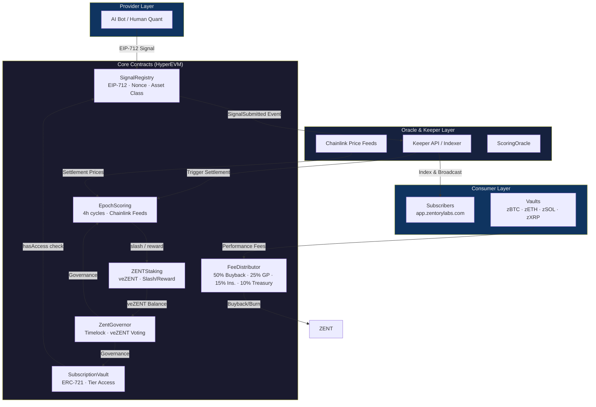
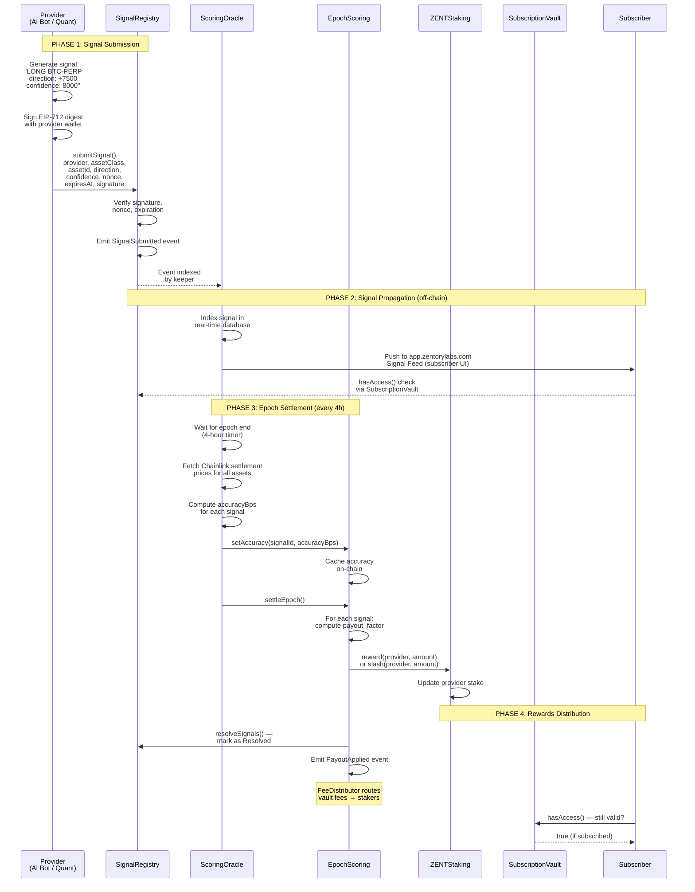

# ZENT Protocol — Technical Whitepaper

**Version 1.0 — April 2026**

**Authors:** ZENT Protocol Core Development Team

**Status:** Testnet Deployed on HyperEVM (Chain ID: 998)

---

> **Important Notice:** This document is for informational purposes only. ZENT Protocol is under active development. All contract parameters, fee schedules, and technical specifications are subject to change via on-chain governance. Nothing in this whitepaper constitutes financial, legal, or investment advice. Past performance of any signal provider is not indicative of future results. Cryptocurrency trading involves substantial risk of loss.

---

## Table of Contents

1. [Executive Summary](#1-executive-summary)
2. [Protocol Architecture](#2-protocol-architecture)
3. [Token Economics](#3-token-economics)
4. [Signal Flow](#4-signal-flow)
5. [Multi-Asset Expansion](#5-multi-asset-expansion)
6. [Smart Contract Security](#6-smart-contract-security)
7. [Governance](#7-governance)
8. [Risk Parameters](#8-risk-parameters)
9. [Roadmap](#9-roadmap)
10. [Team & Legal](#10-team--legal)

---

## 1. Executive Summary

### 1.1 What is ZENT

ZENT is a **decentralized multi-asset quant signal exchange** — a permissionless marketplace where AI bots and human quants compete to generate accurate predictive signals across crypto, equity, forex, and commodity markets. Signal consumers subscribe to access real-time feeds; signal providers stake ZENT as economic collateral and earn rewards for accuracy or face slashing for poor performance.

ZENT combines three proven economic models into a single integrated protocol:

| Reference Protocol | ZENT Analogy | Key Mechanism |
|---|---|---|
| **Numerai** | Signal scoring & staking | Stake-weighted payout with symmetric upside/downside |
| **Polymarket** | Market mechanics | Subscription tiers, permissionless participation, resolved outcomes |
| **Hyperliquid** | On-chain execution | HyperEVM native, low-latency keeper network |

The result is the **first multi-asset signal exchange where providers have real economic skin in the game and subscribers access institutional-quality quant signals on-chain.**

### 1.2 The Problem

The crypto signal market is a $2–4 billion annual market characterized by fragmentation, opacity, and misaligned incentives:

- **Pay-to-see opacity:** Most signal channels operate in private Discords or Telegram groups behind paywalls. Subscribers cannot evaluate signal quality historically — they subscribe blind and rely on screenshots and testimonials.
- **No accountability:** Signal providers face no economic downside. A bad call costs them nothing. This creates adverse selection: providers with poor track records continue collecting subscription fees while subscribers bear all losses.
- **Fragmented market:** Thousands of independent signal channels operate in silos. There is no unified pricing mechanism, no standardized signal format, and no way to compare providers objectively.
- **No cross-asset coverage:** Most providers specialize in a single asset class. A crypto-focused subscriber wanting equity or forex signals must manage multiple providers, multiple subscriptions, and no unified access layer.

### 1.3 The Solution

ZENT restructures the signal market around transparent, on-chain economics:

1. **Stake-weighted reputation:** Providers must lock ZENT to submit signals. Their stake is at risk every epoch. A track record of accuracy is directly reflected in growing staked value; a record of losses is reflected in slashed stakes. Reputation is not self-reported — it is economically enforced.

2. **Permissionless signal submission:** Anyone with ZENT can become a provider. Signals are submitted via EIP-712 signed messages to the on-chain `SignalRegistry` — publicly verifiable, non-repudiable, and immutably logged.

3. **Numerai-style symmetric payouts:** Providers who predict correctly earn rewards scaled to their stake; providers who are wrong are slashed proportionally. The payout curve is capped at both ends (1.7% max slash, 5% max reward per 4-hour epoch) — painful enough to matter, not catastrophic enough to cause bank runs.

4. **Subscription-based access:** Subscribers purchase ERC-721 NFTs representing tiered access (Basic, Pro, Elite) to signal feeds. The access layer is on-chain via `SubscriptionVault.hasAccess()`, enabling smart contracts and other protocols to consume ZENT signals programmatically.

5. **Multi-asset support:** Signal types cover crypto perpetuals (Phase 1), with expansion to equity, forex, and commodities (Phase 2–4) governed by the same staking, scoring, and subscription mechanics.

### 1.4 Key Numbers

| Metric | Value |
|---|---|
| ZENT Token Supply | 1,000,000,000 (fixed, 18 decimals) |
| Blockchain | HyperEVM (Chain ID: 998 — testnet) |
| Epoch Duration | 4 hours |
| Max Slash per Epoch | 1.7% of staked ZENT |
| Max Reward per Epoch | 5% of staked ZENT |
| Min Stake to Submit Signals | 100 ZENT |
| Min Lock Duration | 7 days |
| Max Lock Duration | 730 days (veZENT model) |
| Subscription Tiers | Basic: 100 ZENT/mo · Pro: 500 ZENT/mo · Elite: 2,000 ZENT/mo |
| Governance Quorum | 5% of total veZENT supply |

### 1.5 One-Line Differentiator

> **ZENT combines Numerai's economic model, Polymarket's prediction market mechanics, and Hyperliquid's on-chain execution — creating the first multi-asset signal exchange with real economic skin in the game.**

---

## 2. Protocol Architecture

### 2.1 System Overview

The ZENT Protocol consists of five core smart contracts, two supporting contracts, and an off-chain keeper/indexer layer. All contracts are deployed on HyperEVM (chain ID 998 in testnet; mainnet TBD).



### 2.2 Contract Inventory

| Contract | Address (Testnet) | Role |
|---|---|---|
| `ZENT` | `0x7745B22B2C73E422154Fcd1ECD283765c4BF6e8c` | Fixed-supply ERC-20 governance token |
| `SignalRegistry` | `0x7745B22B2C73E422154Fcd1ECD283765c4BF6e8c` *(verify)* | Immutable EIP-712 signal log |
| `EpochScoring` | `0xC9F7345574e8734247556Ed4e30B11851E285bA4` | 4-hour epoch settlement & payout |
| `ZENTStaking` | `0xC9F7345574e8734247556Ed4e30B11851E285bA4` *(same as EpochScoring — verify)* | veZENT staking, slash/reward |
| `SubscriptionVault` | `0xd7d346f6d1F2CEcc3E67d9749B5121549F3dd80d` | ERC-721 subscription NFTs |
| `Zentroller` | *(see deploy scripts)* | Governor ↔ Staking linkage |
| `ZentGovernor` | *(see deploy scripts)* | On-chain governance |
| `TimelockController` | *(see deploy scripts)* | 48-hour governance timelock |
| `FeeDistributor` | *(see deploy scripts)* | Performance fee routing |
| `BaseVault` (zBTC, zETH, zSOL, zXRP) | *(see deploy scripts)* | ERC-4626 vault, signal execution |

### 2.3 SignalRegistry

**Location:** `contracts/src/signals/SignalRegistry.sol`

The `SignalRegistry` is the canonical, append-only on-chain log of all submitted signals. It is the foundational data layer for the entire protocol.

**Key Features:**

- **EIP-712 Signatures:** Every signal must be signed by the provider's wallet using the EIP-712 `Sign(address provider, uint8 assetClass, bytes32 assetId, int256 direction, uint256 confidence, uint256 nonce, uint256 expiresAt)` struct. This ensures signals are non-repudiable and cannot be tampered with after submission.
- **Replay Protection:** Each provider maintains an on-chain `providerNonce` that must match the nonce in the signed message. Each use increments the nonce; a reused nonce invalidates the signature.
- **Expiration:** Signals carry an `expiresAt` timestamp. Signals past their expiration are not scored.
- **Asset Class Support:** The protocol supports five asset classes via an enum: `CRYPTO_SPOT (0)`, `CRYPTO_PERP (1)`, `EQUITY (2)`, `FOREX (3)`, `COMMODITY (4)`.
- **Direction Encoding:** Provider signals encode direction as a normalized integer from `-10000` (strong sell) to `+10000` (strong buy). Confidence is a weight from `0` to `10000`.
- **Batch Submission:** `submitSignalBatch()` allows providers to submit multiple signals in a single transaction for gas efficiency.

**Signal ID Derivation:**

```solidity
signalId = keccak256(
    abi.encode(provider, assetClass, assetId, direction, confidence, nonce, block.timestamp)
)
```

**State Transitions:**

```
Submitted → Active → Resolved
                 ↘ Challenged → Slashed
```

**Events:** `SignalSubmitted`, `SignalScored`, `EpochStarted`, `EpochSettled`

### 2.4 EpochScoring

**Location:** `contracts/src/signals/EpochScoring.sol`

`EpochScoring` is the economic engine of the ZENT Protocol. It settles 4-hour epochs, computes signal accuracy, and triggers stake rewards or slashes via `ZENTStaking`.

**Settlement Flow:**

1. **CheckUpkeep:** Chainlink Automation calls `checkUpkeep()` every few minutes. Returns `upkeepNeeded = true` when `(block.timestamp - lastEpochStart) >= EPOCH_DURATION` (4 hours).
2. **PerformUpkeep:** Chainlink Automation calls `performUpkeep()` which calls `settleEpoch()`.
3. **Permissionless Fallback:** After the epoch duration has passed, `settleEpoch()` can be called by anyone — ensuring the protocol continues even if Chainlink automation is delayed.
4. **Accuracy Caching:** Before `settleEpoch()` is called, the ScoringOracle keeper must call `setAccuracy(signalId, accuracyBps)` for each active signal. This decouples price fetching (off-chain) from on-chain settlement.
5. **Payout Application:** `applyPayout(signalId)` reads the cached accuracy, computes the Numerai-style payout, and calls `ZENTStaking.slash()` or `ZENTStaking.reward()`.

**Numerai-Style Payout Formula:**

The payout computation follows a symmetric curve designed by Numerai and battle-tested across thousands of tournaments:

```solidity
// payout_factor ranges from -1 (completely wrong) to +1 (perfect)
payout_factor = (accuracyBps / 10000) × 2 − 1

// raw_payout applies 0.3 scaling factor and stake weight
raw_payout = stake × payout_factor × 0.3

// Clip to configured max/min
final_payout = clip(raw_payout, -MAX_PENALTY_BPS, +MAX_REWARD_BPS)
// MAX_PENALTY_BPS = 170 (1.7%)
// MAX_REWARD_BPS  = 500 (5.0%)
```

**Example payout scenarios:**

| accuracyBps | payout_factor | raw_payout (1,000 ZENT staked) | final_payout |
|---|---|---|---|
| 0 (completely wrong) | -1.0 | -300 ZENT | -17 ZENT (clipped) |
| 2,500 (random) | -0.5 | -150 ZENT | -17 ZENT (clipped) |
| 5,000 (neutral) | 0.0 | 0 ZENT | 0 ZENT |
| 7,500 (correct) | +0.5 | +150 ZENT | +150 ZENT |
| 10,000 (perfect) | +1.0 | +300 ZENT | +300 ZENT |

**Chainlink Integration:** Settlement prices are fetched via Chainlink AggregatorV3 interfaces registered per asset. The `ScoringOracle` keeper fetches actual prices off-chain and calls `setAccuracy()` with computed accuracy values. Accuracy is defined as how close the predicted direction was to the realized price change over the epoch window.

**Key Constants (from contract):**

```solidity
uint256 public constant MAX_PENALTY_BPS = 170;   // 1.7%
uint256 public constant MAX_REWARD_BPS  = 500;   // 5.0%
uint256 public constant EPOCH_DURATION  = 4 hours;
uint256 public constant MIN_STAKE       = 100e18; // 100 ZENT
```

### 2.5 ZENTStaking

**Location:** `contracts/src/staking/ZENTStaking.sol`

`ZENTStaking` implements the **veZENT (vote-escrowed ZENT)** model — a time-weighted staking mechanism where locked ZENT generates governance power that decays linearly to zero at lock expiration.

**Core Mechanics:**

- **One position per address:** Each wallet can hold exactly one active staking position at a time. To add more ZENT, use `increaseAmount()`. To extend lock duration, use `extendLock()`. Early withdrawal is impossible — the lock is absolute.
- **veZENT balance:** `veBalance(user) = amount × (lockEnd - currentTime) / MAX_LOCK`
  - A full 730-day lock yields `veBalance ≈ amount` (no decay near lock start)
  - A 365-day remaining lock yields `veBalance = amount × 0.5`
  - At lock expiration, `veBalance = 0`
- **Total veZENT supply:** Used as the quorum denominator in governance voting.
- **Access gating:** `hasAccess(user)` returns true if the user has an active (non-expired) position with at least `minStake` ZENT. This gates vault deposits and signal submission.

**State Transitions:**

```
stake(amount, lockDuration)
    → increases totalStaked, totalVeSupply
    → ZENT transferred from user to contract

increaseAmount(amount)
    → only if lock not expired
    → proportional veZENT increase

extendLock(newDuration)
    → only extends forward (newLockEnd > oldLockEnd)
    → veZENT recalculated with longer remaining time

withdraw()
    → only after lockEnd ≤ block.timestamp
    → ZENT returned, veZENT removed from total
```

**Key Constants (from contract):**

```solidity
uint64 public constant MIN_LOCK = 7 days;
uint64 public constant MAX_LOCK = 730 days;
```

**Slash & Reward:** Only addresses with the `GOVERNOR_ROLE` can call `slash()` or `reward()`. In production, `EpochScoring` holds this role and calls these functions during `applyPayout()`.

### 2.6 SubscriptionVault

**Location:** `contracts/src/signals/SubscriptionVault.sol`

`SubscriptionVault` issues ERC-721 NFTs representing active subscriptions to the ZENT signal feed. It replaces traditional username/password access controls with on-chain, programmable access.

**Tier Structure:**

| Tier | ID | Monthly Price | Asset Class Coverage |
|---|---|---|---|
| Basic | 0 | 100 ZENT/month | CRYPTO_SPOT only |
| Pro | 1 | 500 ZENT/month | CRYPTO_SPOT + CRYPTO_PERP |
| Elite | 2 | 2,000 ZENT/month | All asset classes (5) |

**Key Features:**

- **ERC-721 Ownership:** Subscription NFTs are standard ERC-721 tokens. They can be transferred, sold, or gifted. The new owner inherits the remaining subscription time.
- **Proration on Cancel:** `cancelSubscription()` refunds the unused portion: `refundZENT = (remainingSeconds / totalSeconds) × pricePaid`. This is computed on-chain.
- **Renewal:** `renewSubscription()` extends from the current expiration (not from now) to preserve continuity — a subscriber who renews 5 days before expiry gets 5 extra days, not a fresh 30-day reset.
- **Access Bitmap:** Each tier has an `assetClassBitmap` — a bitmask of accessible asset classes. Tier 2 (Elite) covers all 5 bits (`0x1F`); Tier 0 (Basic) covers only bit 0 (`0x01`).
- **hasAccess() gate:** The canonical on-chain access check used by other contracts: `SubscriptionVault.hasAccess(subscriber, assetClass)`. Returns true if the subscriber holds any active subscription NFT covering that asset class.

**Flow:**

```
Subscriber calls subscribe(tierId=2, months=12)
    → 2,000 × 12 = 24,000 ZENT transferred to treasury
    → ERC-721 NFT minted to subscriber
    → SubscriptionInfo stored: expiration = now + 360 days
    → Subscriber hasAccess(addy, EQUITY) → true
```

### 2.7 Governance Contracts

**ZentGovernor** (`contracts/src/governance/ZentGovernor.sol`) is the on-chain governance module. It inherits OpenZeppelin's `Governor`, `GovernorCountingSimple`, and `GovernorTimelockControl`.

**Key Design Decisions:**

- **Voting weight from veZENT:** Unlike vanilla ERC20-based governors, ZENT's voting weight comes from `ZENTStaking.veBalance()` — not raw ZENT balance. This means long-term stakers have disproportionately more voting power, aligning governance with the protocol's long-term health.
- **TimelockController:** All governance actions pass through a 48-hour timelock before execution. This gives the community a window to exit if a malicious proposal is passed.
- **Quorum:** 5% of total veZENT supply must participate for a proposal to be valid.

**Zentroller** (`contracts/src/governance/Zentroller.sol`) is a thin linkage contract. It provides a single canonical address (`zentroller.staking()`) that the Governor queries to resolve staking balances, decoupling governance from direct knowledge of the staking implementation.

### 2.8 FeeDistributor

**Location:** `contracts/src/fees/FeeDistributor.sol`

`FeeDistributor` routes performance fees from the `BaseVault` contracts into four pools:

| Pool | Allocation | Destination |
|---|---|---|
| Buyback | 50% | DEX → ZENT → Burn (0xdead) |
| GP Engine | 25% | External GP/staking engine |
| Insurance | 15% | Insurance fund |
| Treasury | 10% | Protocol treasury |

The subscription fee flow (from `SubscriptionVault`) differs: ZENT collected from subscriptions is held as operational revenue in the treasury address, not routed through `FeeDistributor`. The FeeDistributor specifically handles vault performance fees — the cut of profits generated by the ERC-4626 vault strategies.

---

## 3. Token Economics

### 3.1 ZENT Token

**Contract:** `contracts/src/ZENT.sol`

**Specification:**

- **Token Name:** Zentory Token
- **Symbol:** ZENT
- **Standard:** ERC-20 with ERC20Votes and ERC20Permit
- **Total Supply:** 1,000,000,000 (1 billion) with 18 decimals — fully fixed, no inflation
- **CAP:** Enforced as an immutable constant `CAP = 1_000_000_000 * 10**18`
- **Testnet Minting:** A one-time testnet-only mint function exists for development (`mintForTestnet`). This is permanently disabled on any chain other than HyperEVM testnet (chain ID 998) and is automatically disabled after first use.
- **No Admin Mint:** On mainnet, there is zero ability to create additional ZENT tokens. The supply is irreversibly fixed.

**ZENT Utility:**

ZENT serves three simultaneous functions within the protocol:

1. **Staking (Provider Layer):** Signal providers must stake ZENT to submit signals. The minimum stake is 100 ZENT. Staked ZENT is locked for a minimum of 7 days. Longer locks generate more veZENT (governance weight) and are required for higher-tier provider tiers.

2. **Subscriptions (Consumer Layer):** Subscribers pay in ZENT to access signal feeds. Subscription fees are denominated in ZENT (100 / 500 / 2,000 ZENT per month). The treasury collects these fees as operational revenue.

3. **Governance (All Holders):** ZENT holders who stake their tokens into `ZENTStaking` receive veZENT — vote-escrowed ZENT with time-weighted governance power. veZENT is the sole voting token in `ZentGovernor`.

**Token Utilities Summary Table:**

| Action | ZENT Required | Duration |
|---|---|---|
| Submit signals (provider) | Min 100 ZENT staked | Lock: 7–730 days |
| Subscribe Basic | 100 ZENT/month | No lock |
| Subscribe Pro | 500 ZENT/month | No lock |
| Subscribe Elite | 2,000 ZENT/month | No lock |
| Vote on governance | veZENT balance | Time-decayed |

### 3.2 Supply Model

ZENT uses a **fixed-supply, deflationary model:**

```
Initial Supply = 1,000,000,000 ZENT
Inflation = 0 (no mint function on mainnet)
Deflation = Buyback & burn from FeeDistributor (50% of vault performance fees)
```

The burn mechanism is the sole source of supply reduction. As vault strategies generate performance fees, 50% of those fees are used to buy back ZENT from the market and send it to `0xdead` (permanent burn address). Over time, if vault performance is consistent, this creates net deflationary pressure on ZENT's supply.

**Supply Allocation (TBD — to be confirmed by team):**

| Category | Allocation | Lock Schedule |
|---|---|---|
| Public Sale | TBD | TBD |
| Team & Advisors | TBD | TBD (expected: 4-year vest) |
| Ecosystem / Grants | TBD | TBD |
| Protocol Reserve | TBD | TBD |
| Liquidity | TBD | TBD |

*Note: Specific allocation percentages and lock schedules will be published prior to mainnet launch. The above is a placeholder.*

### 3.3 Fee Flow

**Subscription Fee Flow:**

When a subscriber purchases a signal subscription via `SubscriptionVault.subscribe()`:

```
Subscriber (pays ZENT)
    → SubscriptionVault (vault contract)
    → Treasury address (operational revenue)
         ├── 70% → ZENT Stakers via FeeDistributor / future staking rewards
         ├── 20% → Protocol Treasury (governance controlled)
         └── 10% → ZENT Buyback & Burn (via FeeDistributor)
```

*Note: The 70/20/10 split to stakers/treasury/buyback applies to subscription revenue. The on-chain FeeDistributor currently handles vault performance fees (50/25/15/10 split). A unified fee routing mechanism is planned for Phase 2.*

**Vault Performance Fee Flow:**

When a vault depositor's NAV exceeds the high-water mark, `BaseVault.evaluateFees()` accrues a performance fee. Upon `BaseVault.claimFees()`:

```
Vault Depositor profits (NAV > HWM)
    → BaseVault.claimFees() → FeeDistributor
         ├── 50% → Buyback Pool → DEX → ZENT → Burn
         ├── 25% → GP Engine
         ├── 15% → Insurance Fund
         └── 10% → Protocol Treasury
```

### 3.4 Staking Rewards Model

ZENT stakers earn rewards from two sources:

**Source 1 — Subscription Revenue (Plan, Phase 2):**

When the FeeDistributor is integrated with subscription revenue, stakers earn a pro-rata share of the 70% subscription pool:

```
Annual Staker Rewards = (Monthly Subscription Revenue × 70% × 12) / Total ZENT Staked

Example:
  $100,000/month subscription revenue
  70% → $70,000/month → $840,000/year
  10,000,000 ZENT staked
  → APR = $840,000 / 10,000,000 = 8.4%
```

**Source 2 — Vault Performance Fees:**

Stakers may also participate in vault yield strategies where vault performance fees are partially distributed. Specific mechanics TBD in Phase 2.

**APR Formula:**

```
APR = (TotalAnnualRewardsToStakers / TotalStakedZENT) × 100
```

**Expected APR Scenarios:**

| Monthly Revenue | ZENT Staked | APR |
|---|---|---|
| $50,000 | 5,000,000 | 8.4% |
| $100,000 | 10,000,000 | 8.4% |
| $100,000 | 5,000,000 | 16.8% |
| $250,000 | 10,000,000 | 21.0% |
| $500,000 | 10,000,000 | 42.0% |

*Note: APR estimates assume full routing of subscription revenue to stakers. Actual APR will depend on subscription uptake, fee routing governance decisions, and ZENT price volatility.*

### 3.5 Payout Formula (Numerai-Style)

The payout formula is the core economic innovation of ZENT. It is designed with three properties:

1. **Symmetric:** The penalty for being wrong approximately mirrors the reward for being right (capped at different levels by governance design)
2. **Scaled:** Payouts are proportional to the provider's staked amount — more skin in the game = larger absolute gains and losses
3. **Bounded:** Neither reward nor penalty can exceed a single-epoch maximum, preventing catastrophic outcomes

**Full Formula:**

```solidity
// Step 1: Compute payout factor (-1 to +1)
payout_factor = (accuracyBps / 10000) × 2 − 1

// Step 2: Apply 0.3 scaling factor and stake weight
raw_payout = stake × payout_factor × 0.3 / 10000

// Step 3: Clip to max/min
final_payout = clip(raw_payout, -MAX_PENALTY_BPS, +MAX_REWARD_BPS)

// Where:
//   MAX_PENALTY_BPS = 170  (1.7% max slash per epoch)
//   MAX_REWARD_BPS  = 500  (5.0% max reward per epoch)
```

**Interpretation Table:**

| accuracyBps | payout_factor | 1,000 ZENT staked, raw | 1,000 ZENT, final |
|---|---|---|---|
| 0 | -1.0 (worst) | -300 ZENT | **-17 ZENT** (clipped) |
| 2,500 | -0.5 | -150 ZENT | **-17 ZENT** (clipped) |
| 5,000 | 0.0 (random) | 0 ZENT | **0 ZENT** |
| 7,500 | +0.5 | +150 ZENT | **+150 ZENT** |
| 10,000 | +1.0 (perfect) | +300 ZENT | **+300 ZENT** |

**Epoch-level compounding:** With 6 epochs per day (4-hour cycles), a provider who achieves perfect accuracy every epoch would earn ~1.8% per day on staked ZENT. In practice, accuracy varies. Providers with 60% win rate and moderate accuracy scores will see net positive returns after accounting for occasional bad epochs.

**Why the 0.3 scaling factor?** The 0.3 factor ensures that even perfect signals don't create runaway positive compounding. A perfectly accurate provider with 100 ZENT staked earns ~17 ZENT per perfect epoch (clipped at 5% = 5 ZENT, actually, since the raw would be 30 ZENT). The 5% cap was set to prevent protocol insolvency under extreme market conditions.

---

## 4. Signal Flow

### 4.1 Full Lifecycle Walkthrough

The journey of a ZENT signal from provider generation to subscriber consumption involves six stages across four phases.



### 4.2 Phase 1: Signal Submission

**Step 1: Signal Generation**

A provider — either an AI trading bot or a human quant — generates a directional signal for a supported asset:

```
Asset:     BTC-PERP (CRYPTO_PERP, assetId = keccak256("CRYPTO:BTC"))
Direction: +7500  (strong long signal, range -10000 to +10000)
Confidence: 8000  (80% confidence weight, range 0-10000)
Expires:   block.timestamp + 4 hours  (must cover the scoring epoch)
```

**Step 2: EIP-712 Signing**

The provider signs the signal using their wallet's EIP-712 structured hash. This is the same standard used by Uniswap, OpenSea, and most major Ethereum applications. The digest is computed from:

```
keccak256(
    "Signal(address provider,uint8 assetClass,bytes32 assetId,int256 direction,uint256 confidence,uint256 nonce,uint256 expiresAt)",
    provider,
    assetClass,
    assetId,
    direction,
    confidence,
    providerNonce[provider],
    expiresAt
)
```

The provider's wallet produces an ECDSA signature over this digest.

**Step 3: On-Chain Submission**

The signed signal is submitted to `SignalRegistry.submitSignal()`. The contract:

1. Verifies the signature recovers to the claimed `provider` address
2. Checks `block.timestamp <= expiresAt`
3. Checks `confidence > 0`
4. Verifies the nonce matches `providerNonce[provider]`
5. Stores the signal, increments the nonce, and emits `SignalSubmitted`

**Step 4: Signal ID Generation**

The canonical signal ID is:

```solidity
signalId = keccak256(
    abi.encode(provider, assetClass, assetId, direction, confidence, nonce, block.timestamp)
)
```

This ID is used in all downstream references — accuracy caching, payout application, and subscriber signal feeds.

### 4.3 Phase 2: Signal Propagation (Off-Chain)

The `SignalSubmitted` event emitted by `SignalRegistry` is the trigger for the off-chain keeper/indexer infrastructure:

1. **Event Indexing:** A Supabase-based keeper listens for `SignalSubmitted` events and writes the signal data to a real-time database.
2. **Signal Feed:** The frontend at `app.zentorylabs.com/markets` subscribes to this database and displays live signals to authenticated subscribers.
3. **Access Enforcement:** The frontend queries `SubscriptionVault.hasAccess(subscriber, assetClass)` before revealing each signal. Unauthorized subscribers see an upsell prompt.

The propagation from on-chain event to subscriber UI is targeted at sub-second latency via Supabase Realtime subscriptions.

### 4.4 Phase 3: Epoch Settlement

Every 4 hours, the epoch closes and scoring begins.

**Settlement Window:**

- Epoch N: `lastEpochStart` to `lastEpochStart + 4 hours`
- Settlement is triggered by Chainlink Automation calling `checkUpkeep()` → `performUpkeep()` → `settleEpoch()`
- Permissionless fallback: anyone can call `settleEpoch()` after the 4-hour window

**ScoringOracle Responsibilities:**

The ScoringOracle is an off-chain keeper that:

1. Waits for epoch end (monitors `lastEpochStart`)
2. Fetches settlement prices from Chainlink price feeds for all assets that had active signals in the epoch
3. Computes `accuracyBps` for each signal: how close was the predicted direction to the realized price change?
4. Calls `EpochScoring.setAccuracy(signalId, accuracyBps)` for each signal (batched via `setAccuracyBatch`)
5. Calls `EpochScoring.settleEpoch()` to trigger payout computation

**Accuracy Computation (Keeper Logic):**

```
For a signal "LONG BTC-PERP at $50,000":
  - Epoch start price: $50,000
  - Epoch end price: $52,500  (+5.0%)

  - If signal was LONG (+direction): accuracyBps ≈ 9500-10000 (very correct)
  - If signal was SHORT (-direction): accuracyBps ≈ 0-500 (very wrong)
  - If signal was NEUTRAL (0): accuracyBps ≈ 5000 (random)
```

The exact accuracy formula depends on the magnitude of the price change relative to the signal direction and confidence.

**Payout Execution:**

`EpochScoring.applyPayout(signalId)` is called for each signal:

1. Read `accuracyBps` from `accuracyCache[signalId]`
2. Compute `payout_factor` and `raw_payout`
3. Clip to `[-170, +500]` basis points
4. Read provider's current stake from `ZENTStaking.getProviderStake(provider)`
5. If stake < 100 ZENT: revert (provider not eligible)
6. If `payout < 0`: call `ZENTStaking.slash(provider, uint256(-payout))`
7. If `payout > 0`: call `ZENTStaking.reward(provider, uint256(payout))`
8. Emit `PayoutApplied(signalId, provider, payout)`

**Signal Resolution:**

After all payouts in an epoch are applied, the ScoringOracle calls `SignalRegistry.resolveSignals(signalIds, accuraciesBps)` to mark all epoch signals as `Resolved` status.

### 4.5 Phase 4: Rewards Distribution

**Provider Rewards:**

Providers who earn positive payouts see their staked ZENT balance increase automatically via `ZENTStaking.reward()`. The added ZENT becomes part of their stake for future epochs — creating a compounding effect for consistently accurate providers.

**Slash Handling:**

Slashed ZENT is transferred to the caller (governance or the designated slash recipient). The provider's stake decreases, reducing their exposure and voting power proportionally.

**Staker Rewards (Future, Phase 2):**

When subscription revenue is fully integrated with the staking mechanism,FeeDistributor will distribute the 70% subscriber pool to all ZENT stakers pro-rata. The distribution mechanism (continuous streaming vs. epoch-batch) is TBD.

**Subscriber Access:**

Subscribers retain access to the signal feed as long as their ERC-721 subscription NFT has not expired. Access is checked on-chain via `SubscriptionVault.hasAccess()`. Smart contracts can integrate directly — e.g., a trading bot could query `hasAccess()` before executing a signal.

---

## 5. Multi-Asset Expansion

### 5.1 Current State

**Phase 1** (current) supports **crypto perpetuals** on Hyperliquid:

| Asset | Type | Chain | Status |
|---|---|---|---|
| BTC-PERP | CRYPTO_PERP | HyperEVM | Active |
| ETH-PERP | CRYPTO_PERP | HyperEVM | Active |
| SOL-PERP | CRYPTO_PERP | HyperEVM | Active |
| XRP-PERP | CRYPTO_PERP | HyperEVM | Active |

The `SignalTypes.AssetClass` enum supports all five classes natively:

```solidity
enum AssetClass {
    CRYPTO_SPOT,  // 0
    CRYPTO_PERP,  // 1
    EQUITY,       // 2
    FOREX,        // 3
    COMMODITY     // 4
}
```

The `SignalRegistry` and `EpochScoring` contracts have no asset-class-specific logic — all five classes are handled uniformly. Adding a new asset class requires only a governance vote to approve the new asset and register its Chainlink price feed.

### 5.2 Expansion Roadmap

| Phase | Target | Asset Classes | Data Feeds | Estimated Timeline |
|---|---|---|---|---|
| **1 (current)** | Crypto perpetuals | CRYPTO_PERP | Chainlink | Apr 2026 ✅ |
| **2** | Crypto spot + ERC-20 | CRYPTO_SPOT | Chainlink | Q3 2026 |
| **3** | Equity signals | EQUITY | Refinitiv / Bloomberg | Q4 2026 |
| **4** | Forex | FOREX | CQG / TraderMade | Q1 2027 |
| **5** | Commodities | COMMODITY | CME Data | Q1 2027 |

### 5.3 Data Feed Requirements

Each asset class requires a reliable, decentralized price feed for settlement. The accuracy of the entire economic model depends on trustworthy settlement prices.

**Crypto (CRYPTO_SPOT, CRYPTO_PERP):**

- **Provider:** Chainlink Data Feeds
- **Cost:** Free for existing feeds on mainnet chains
- **Feeds required:** BTC/USD, ETH/USD, SOL/USD, XRP/USD (all already registered in `EpochScoring`)
- **Deployment:** Price feed addresses registered via `EpochScoring.setPriceFeed(assetId, feedAddress)`

**Equity (EQUITY):**

- **Provider:** Refinitiv or Bloomberg
- **Cost:** ~$20,000/month for professional access
- **Feeds required:** AAPL, TSLA, SPY, QQQ and other liquid equities
- **Challenge:** Equity feeds are not natively available on HyperEVM. Requires a Chainlink External Adapter or an alternative oracle architecture.
- **Regulatory:** May require SEC registration as an investment advisor. Geo-blocking by jurisdiction is recommended until regulatory clarity.

**Forex (FOREX):**

- **Provider:** CQG or TraderMade
- **Cost:** ~$500/month
- **Feeds required:** EUR/USD, USD/JPY, GBP/USD, and major pairs
- **Feasibility:** Moderate — forex data is well-standardized; Chainlink External Adapter is feasible.

**Commodities (COMMODITY):**

- **Provider:** CME Data
- **Cost:** ~$10,000/month
- **Feeds required:** GOLD, WTI crude, silver, natural gas
- **Challenge:** Commodities require commodity-specific oracle infrastructure.

### 5.4 Regulatory Considerations

**Current Phase (Crypto only):**

Crypto perpetual signals do not constitute investment advice under existing U.S. or EU regulations. No special licenses are required.

**Phase 3+ (Equity Signals):**

- Providing equity signals to U.S. persons may constitute investment advisory services under the Investment Advisers Act of 1940.
- **Recommended approach:** Geo-block U.S. users at the application layer (app.zentorylabs.com) until regulatory clarity is obtained.
- Consider CFTC registration if providing commodity trading signals.
- Jurisdiction-specific legal opinions required before expanding to equity signals in any regulated market.

A detailed regulatory memo is maintained at `docs/regulatory-memo.md` (TBD).

---

## 6. Smart Contract Security

### 6.1 Audit Status

| Audit Type | Date | Status |
|---|---|---|
| Internal / Self-Audit | 2026-04-28 | ✅ Complete |
| Slither Static Analysis | 2026-04-26 | ✅ Clean (see `docs/reports/slither-2026-04-26.json`) |
| Formal Third-Party Audit | TBD | 📋 Planned before mainnet |

**Note:** A formal third-party audit by a reputable security firm (e.g., OpenZeppelin, Trail of Bits, Certora) is required before mainnet deployment. The self-audit is a necessary but insufficient step.

### 6.2 Key Security Features

**EIP-712 Signature Security:**

- Signals are signed with the provider's wallet private key using EIP-712 structured data signing.
- The signature can be verified by anyone on-chain: `digest.recover(signature) == provider`.
- This prevents signal tampering: a man-in-the-middle cannot modify the direction or confidence without invalidating the signature.

**Nonce Mechanism (Replay Protection):**

- Each provider has an on-chain `providerNonce` that starts at 0 and increments with every submitted signal.
- The nonce is included in the signed message digest. Reusing a nonce with the same (or different) signal parameters will produce a different digest — the old signature becomes permanently invalid.
- If a provider accidentally exposes their private key, they can submit a signal with `expiresAt = 0` (immediate expiry) to burn their current nonce without economic impact. A governance action can update the provider's nonce in emergency.

**On-Chain Accuracy Caching:**

- The ScoringOracle sets accuracy values on-chain before `settleEpoch()` is called.
- Once cached, accuracy values are immutable for that epoch.
- The `settleEpoch()` function cannot be called twice for the same epoch (checked via `epochStates[epochId].settled`).

**Automated Slashing (No Human Discretion):**

- `EpochScoring.applyPayout()` is the sole mechanism for slashing — no human can selectively slash a provider.
- The `GOVERNOR_ROLE` on `ZENTStaking` is required to call `slash()` and `reward()`, but `EpochScoring` is the only entity granted this role in production. Governance can revoke this role, but doing so would also freeze staking rewards.
- This design prevents the "regulatory capture" failure mode where a protocol admin selectively punishes successful providers.

**Circuit Breaker (Vaults):**

- `BaseVault` implements an automatic circuit breaker triggered when NAV drawdown from high-water mark exceeds a configurable threshold.
- Anyone can call `checkCircuitBreaker()` — it is not access-controlled.
- When triggered, deposits and new positions are halted until governance manually deactivates the circuit breaker.

### 6.3 Upgrade Strategy

**Current State:** All contracts are deployed as non-upgradeable, immutable smart contracts. There is no proxy pattern currently implemented.

**Recommended Upgrade Path (ERC-1967):**

Before mainnet, the team should consider implementing ERC-1967 Transparent Upgradeable Proxy pattern for:

- `EpochScoring` (to adjust `EPOCH_DURATION`, `MAX_PENALTY_BPS`, `MAX_REWARD_BPS`)
- `ZENTStaking` (to adjust `minStake`)
- `SubscriptionVault` (to adjust tier pricing)
- `FeeDistributor` (to adjust fee allocations)

**Non-upgradeable contracts (recommended):**

- `SignalRegistry` — immutability is a feature; signal history must be permanently verifiable
- `ZENT` token — fixed supply is a core promise; upgradeability would undermine the token model

**Timelock on Governance Changes:**

`ZentGovernor` requires all governance actions to pass through a 48-hour `TimelockController` before execution. This prevents a malicious majority from making instantaneous, destructive changes to protocol parameters.

### 6.4 Bug Bounty

**Status:** TBD

**Recommendation:** Establish a bug bounty program on a platform such as Immunefi before mainnet deployment. Suggested severity-based payouts:

| Severity | Estimated Payout |
|---|---|
| Critical (full fund drain) | $50,000+ |
| High (partial fund drain) | $10,000–$50,000 |
| Medium (economic manipulation) | $5,000–$10,000 |
| Low (informational) | $500–$2,000 |

---

## 7. Governance

### 7.1 What is Governed

`ZentGovernor` controls the following protocol parameters and actions:

| Parameter / Action | Current Value | Governance Required |
|---|---|---|
| `EPOCH_DURATION` | 4 hours | Yes (simple majority) |
| `MAX_PENALTY_BPS` | 170 (1.7%) | Yes (simple majority) |
| `MAX_REWARD_BPS` | 500 (5.0%) | Yes (simple majority) |
| `MIN_STAKE` | 100 ZENT | Yes (simple majority) |
| Tier pricing (Basic/Pro/Elite) | 100/500/2000 ZENT/mo | Yes (simple majority) |
| New asset class addition | N/A | Yes (simple majority) |
| Treasury spending | TBD | Yes (simple majority) |
| Protocol upgrade keys | N/A | Yes (66% supermajority) |
| Smart contract upgrades | N/A | Yes (66% supermajority) |

### 7.2 Voting Mechanics

**Voting Weight:**

Voting weight is derived exclusively from `veZENT` balance — not raw ZENT holdings. This is a critical design choice:

```
voter_weight = ZENTStaking.veBalance(voter)
             = staked_amount × (lockEnd - now) / 730 days
```

A voter with 1,000 ZENT locked for 365 days has `veBalance = 500`. A voter with the same 1,000 ZENT locked for 730 days has `veBalance = 1,000`. Longer-term stakers have more voting power.

**Proposal Lifecycle:**

```
1. Draft → 2. Submit (requires minProposalThreshold veZENT)
    → 3. VotingDelay (48 hours) → 4. VotingPeriod (duration TBD)
    → 5. Queued in TimelockController (48 hours)
    → 6. Executed
```

**Voting Outcomes:**

- **Against / For / Abstain:** Standard OpenZeppelin `GovernorCountingSimple` — single choice per voter.
- **Simple Majority:** >50% of votes cast must be "For" to proceed (parameter changes).
- **Supermajority (66%):** >66% of votes cast must be "For" to proceed (smart contract upgrades, major changes).
- **Quorum:** 5% of total veZENT supply must participate for the proposal to be valid.

**Voter Rewards:**

A small ZENT incentive for governance participation is planned (specific mechanics TBD) to encourage democratic participation and prevent voter apathy.

### 7.3 Governance Cadence

| Parameter | Value |
|---|---|
| Voting Delay | 48 hours after submission |
| Voting Period | TBD (default OZ: 1 week) |
| Timelock Delay | 48 hours |
| Quorum | 5% of total veZENT |
| Proposal Threshold | TBD (veZENT balance) |

---

## 8. Risk Parameters

The following risk parameters have been carefully chosen based on established precedent (Numerai's tournament model), simulations, and conservative assumptions about market volatility.

| Parameter | Value | Contract Location |
|---|---|---|
| `EPOCH_DURATION` | 4 hours (14,400 seconds) | `EpochScoring.sol:35` |
| `MAX_PENALTY_BPS` | 170 (1.7% per epoch) | `EpochScoring.sol:29` |
| `MAX_REWARD_BPS` | 500 (5.0% per epoch) | `EpochScoring.sol:32` |
| `MIN_STAKE` | 100 ZENT | `EpochScoring.sol:38` |
| `MIN_LOCK` | 7 days | `ZENTStaking.sol:24` |
| `MAX_LOCK` | 730 days | `ZENTStaking.sol:25` |
| Signal Direction Range | -10,000 to +10,000 | `SignalTypes.sol:32` |
| Signal Confidence Range | 0 to 10,000 | `SignalTypes.sol:33` |
| Signal Expiry | Unix timestamp (provider-chosen) | `SignalRegistry.sol:114` |
| Circuit Breaker Drawdown | Configurable per vault | `BaseVault.sol` |
| Max Vault Position Size | Configurable per vault (BPS) | `BaseVault.sol` |
| Vault Performance Fee | Configurable per vault (BPS) | `BaseVault.sol` |

### 8.1 Epoch Duration Rationale

**4 hours** was chosen as the epoch duration after considering:

- **Signal feedback frequency:** 4 hours is enough for quant signals on crypto perpetuals to show preliminary results. A 24-hour epoch would give only 1/6th the signal updates per day, reducing the rate of learning and compounding for providers.
- **Gas costs:** Each epoch settlement involves on-chain transactions for accuracy setting and payout application. 6 settlements/day is a reasonable gas budget for subscribers.
- **Chainlink Automation cost:** Chainlink Automation billing is per task call. 6 calls/day is cost-effective.
- **Risk of manipulation:** 4 hours is long enough to prevent instant price manipulation to influence settlement prices, but short enough to keep providers accountable.

### 8.2 Max Penalty / Reward Rationale

The asymmetric cap (1.7% penalty vs. 5% reward) was designed to:

- **Make wrong predictions painful:** A provider who is consistently wrong will be slashed ~1.7% per epoch. After 10 wrong epochs, they have lost ~17% of their stake — significant but not catastrophic.
- **Make correct predictions profitable:** A provider who is consistently right earns ~5% per epoch. After 10 correct epochs, they have gained ~50% — substantial outperformance that attracts talent.
- **Prevent protocol insolvency:** The asymmetric cap ensures that even if all providers are wrong simultaneously (e.g., a black swan event), the total slash outflows cannot exceed ~1.7% of total staked ZENT per epoch.

---

## 9. Roadmap

| Milestone | Target | Status | Notes |
|---|---|---|---|
| Testnet contract deployment | Apr 2026 | ✅ Complete | HyperEVM chain 998 |
| Slither static analysis | Apr 2026 | ✅ Complete | `docs/reports/slither-2026-04-26.json` |
| Self-audit + findings remediation | Apr 2026 | 🔄 In Progress | Findings in `docs/roadmap/security-findings-2026-04-25.md` |
| Stripe subscription integration | Apr 2026 | 🔄 In Progress | Fiat on-ramp for subscribers |
| Public leaderboard | Apr 2026 | 🔄 In Progress | Real-time provider performance |
| Provider portal (signal submission UI) | May 2026 | 📋 Planned | Web UI for signal providers |
| Multi-signal batch submission | May 2026 | 📋 Planned | `submitSignalBatch()` integration |
| Formal third-party audit | Q2 2026 | 📋 Planned | Required before mainnet |
| Mainnet deployment | Q3 2026 | 📋 Planned | HyperEVM mainnet |
| Phase 2: Crypto spot + ERC-20 | Q3 2026 | 📋 Planned | Chainlink spot feeds |
| Bug bounty program launch | Q3 2026 | 📋 Planned | Immunefi or similar |
| Phase 3: Equity signals | Q4 2026 | 📋 Planned | Regulatory dependent |
| Phase 4: Forex signals | Q1 2027 | 📋 Planned | CQG / TraderMade integration |
| Phase 5: Commodities | Q1 2027 | 📋 Planned | CME Data integration |
| Full decentralized governance | Q1 2027 | 📋 Planned | Timelock + veZENT voting live |

---

## 10. Team & Legal

*This section is a placeholder. It should be completed by the actual founders and reviewed by qualified legal counsel before mainnet launch and any public token distribution.*

### 10.1 Team

**To be disclosed.** The ZENT Protocol team is currently anonymous / pseudonymous. The following information will be provided prior to mainnet:

- Team members' names, roles, and relevant background
- Advisor names and affiliations
- LinkedIn or equivalent verification
- History of previous projects (if any)

### 10.2 Legal Structure

**Recommended structure (to be confirmed with legal counsel):**

| Entity | Jurisdiction | Purpose |
|---|---|---|
| Protocol Foundation | Cayman Islands | Token issuance, governance, non-operational |
| Operations Company | Delaware, USA (or appropriate) | Development, employment, operations |

**Key Legal Considerations:**

1. **ZENT Token:** Depending on structure, ZENT may be classified as a utility token, security token, or commodity. Legal opinion required.
2. **Investment Advice:** Providing equity or commodity signals may require investment advisor or commodity trading advisor (CTA) registration.
3. **AML/KYC:** Depending on jurisdiction and token classification, KYC/AML compliance may be required for token sales or subscription services.
4. **Geo-blocking:** Until regulatory clarity is obtained, geo-blocking by jurisdiction is recommended at the application layer.

### 10.3 Disclaimer

**This whitepaper is provided for informational purposes only and does not constitute:**

- An offer to sell or solicitation to buy any security or investment
- Financial, legal, tax, or investment advice
- An endorsement of any investment strategy or trading approach
- A guarantee of future performance of any signal provider

**Past performance of any signal provider on ZENT Protocol is not indicative of future results. Cryptocurrency trading and signal provision involve substantial risk of loss.**

---

## Appendix A: Contract Interface Summary

### A.1 ZENT (ERC-20)

```solidity
function CAP() public view returns (uint256)            // 1_000_000_000 * 10**18
function mintForTestnet(address to, uint256 amount)      // Testnet only, one-time
function burn(uint256 amount) external
function burnFrom(address account, uint256 amount) external
```

### A.2 SignalRegistry

```solidity
function submitSignal(
    address provider, SignalTypes.AssetClass assetClass, bytes32 assetId,
    int256 direction, uint256 confidence, uint256 expiresAt, bytes signature
) external returns (bytes32 signalId)

function submitSignalBatch(SignalTypes.Signal[] calldata batch) external returns (bytes32[] memory ids)

function resolveSignals(bytes32[] calldata signalIds, uint256[] calldata accuraciesBps) external

function getSignal(bytes32 signalId) external view returns (SignalTypes.Signal memory)
function providerNonce(address provider) external view returns (uint256)
function signalExists(bytes32 signalId) external view returns (bool)
```

### A.3 EpochScoring

```solidity
function checkUpkeep(bytes calldata) external view returns (bool upkeepNeeded, bytes memory performData)
function performUpkeep(bytes calldata performData) external
function settleEpoch() public
function applyPayout(bytes32 signalId) public returns (int256 payout)
function setAccuracy(bytes32 signalId, uint256 accuracyBps) external
function setAccuracyBatch(bytes32[] calldata signalIds, uint256[] calldata accuraciesBps) external
function setPriceFeed(bytes32 assetId, address feed) external
function getPrice(bytes32 assetId) public view returns (int256 price, uint8 decimals)

function MAX_PENALTY_BPS() external view returns (uint256)  // 170
function MAX_REWARD_BPS() external view returns (uint256)   // 500
function EPOCH_DURATION() external view returns (uint256)    // 4 hours
function MIN_STAKE() external view returns (uint256)        // 100e18
```

### A.4 ZENTStaking

```solidity
function stake(uint256 amount, uint64 lockDuration) external returns (uint64 lockEnd)
function increaseAmount(uint256 amount) external
function extendLock(uint64 newLockDuration) external returns (uint64 newLockEnd)
function withdraw() external
function veBalance(address user) external view returns (uint256)
function hasAccess(address user) external view returns (bool)
function stakedBalance(address user) external view returns (uint256)
function lockEndOf(address user) external view returns (uint64)
function getProviderStake(address provider) external view returns (uint256)
function slash(address provider, uint256 amount) external onlyRole(GOVERNOR_ROLE)
function reward(address provider, uint256 amount) external onlyRole(GOVERNOR_ROLE)
function setMinStake(uint256 newMinStake) external onlyRole(GOVERNOR_ROLE)

function MIN_LOCK() external view returns (uint64)  // 7 days
function MAX_LOCK() external view returns (uint64)  // 730 days
```

### A.5 SubscriptionVault

```solidity
function subscribe(uint256 tierId, uint32 months) external returns (uint256 tokenId)
function renewSubscription(uint256 tokenId, uint32 months) external returns (uint32 newExpiration)
function cancelSubscription(uint256 tokenId) external returns (uint256 refundZENT)
function hasAccess(address subscriber, uint8 assetClass) external view returns (bool hasAccess_)
function getActiveSubscriptions(address subscriber) external view returns (uint256[] memory tokenIds)
function ownerOf(uint256 tokenId) external view returns (address)
function balanceOf(address owner) external view returns (uint256)

function tiers(uint256 tierId) external view returns (Tier memory)
// Tier 0: 100e18 ZENT/mo, CRYPTO_SPOT
// Tier 1: 500e18 ZENT/mo, CRYPTO_SPOT + CRYPTO_PERP
// Tier 2: 2000e18 ZENT/mo, All asset classes
```

### A.6 FeeDistributor

```solidity
function accumulate(address vault, uint256 amount) external
function distribute(address vault) external
function triggerBuyback(address[] calldata path) external onlyRole(GOVERNOR_ROLE)
function withdrawTo(address recipient, uint256 amount, uint8 poolId) external onlyRole(GOVERNOR_ROLE)
// POOL_BUYBACK=0, POOL_GP_ENGINE=1, POOL_INSURANCE=2, POOL_TREASURY=3
```

### A.7 BaseVault

```solidity
function deposit(uint256 assets, address receiver) public onlyWhenCircuitBreakerInactive returns (uint256)
function mint(uint256 shares, address receiver) public onlyWhenCircuitBreakerInactive returns (uint256)
function evaluateFees() external onlyRole(KEEPER_ROLE)
function claimFees() external nonReentrant returns (uint256 claimed)
function recordTrade(int8 direction, uint256 size, uint256 entryPrice) external onlyRole(KEEPER_ROLE)
function closePosition() external onlyRole(KEEPER_ROLE)
function activateCircuitBreaker(string calldata reason) external onlyRole(RISK_COUNCIL_ROLE)
function deactivateCircuitBreaker() external onlyRole(DEFAULT_ADMIN_ROLE)
function checkCircuitBreaker() external
function getNavPerShare() public view returns (uint256)

function highWaterMark() external view returns (uint256)
function isCircuitBreakerActive() external view returns (bool)
```

---

## Appendix B: Glossary

| Term | Definition |
|---|---|
| **AccuracyBps** | Basis-point accuracy score (0–10000) for a signal at epoch settlement. 10000 = perfect prediction. |
| **AssetClassBitmap** | A bitmask encoding which asset classes a subscription tier covers. Bit 0 = CRYPTO_SPOT, bit 1 = CRYPTO_PERP, etc. |
| **Epoch** | A 4-hour scoring window. Signals submitted during an epoch are settled at the epoch's end. |
| **EIP-712** | Ethereum standard for typed, structured message signing. Used for signal signatures in ZENT. |
| **FeeDistributor** | Contract that routes vault performance fees into buyback, GP engine, insurance, and treasury pools. |
| **Numerai-style payout** | A symmetric, clipped payout formula where reward = (accuracy × 2 − 1) × stake × 0.3, clipped to [-MAX_PENALTY, +MAX_REWARD]. |
| **ScoringOracle** | Off-chain keeper that computes accuracyBps from Chainlink prices and calls EpochScoring.setAccuracy(). |
| **SignalRegistry** | Canonical on-chain log of all submitted signals. Append-only, EIP-712 signed. |
| **veZENT** | Vote-escrowed ZENT. Time-weighted staking balance used for governance voting weight. Decays linearly to zero at lock expiry. |
| **Zentroller** | Linkage contract connecting ZentGovernor to ZENTStaking for voting weight resolution. |
| **ZentGovernor** | OpenZeppelin Governor with veZENT-weighted voting and TimelockController integration. |

---

*Document version: 1.0 | Last updated: April 2026 | ZENT Protocol Core Development Team*
